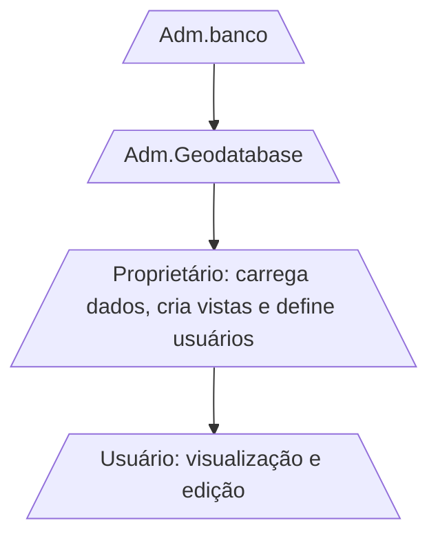

# GEODATABASE

## Componentes

```mermaid
graph TD;
A[/Adm.banco\] --> B[/Adm.Geodatabase\];
B --> C[/Proprietário: carrega dados, cria vistas e define usuários\];
C --> D[/Usuário: visualização e edição\];
```