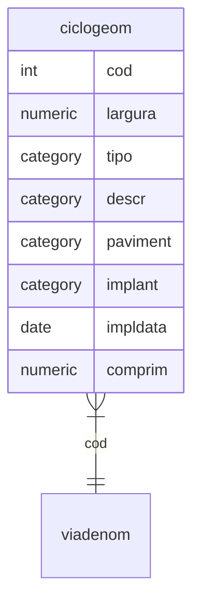

# Malha viária

## viageom: classe de feições, propriedades por seção (polilinha)

Nome     | Campo                  | Descrição
---------|------------------------|----------------------------------------------------------------------------
cod      | *Código                | Identificador
largura | Largura(metros) | Restituição ou projetado
tipo | ciclovia, ciclofaixa ou compartilhada | Ciclovia segragada por obstáculo, ciclofaixa junto ao fluxo de veículos e compartilhada junto ao fluxo de pedestres
descr | travessia, quadra | Particularidades
paviment | concreto, asfalto, sem pavimentação, .|
implant | |
impldata | |
comprim | |
## descrição regras

1. Número inicial(numinici): Relacionar todas as seções do ramo principal menores que a atual, somar seus comprimentos.

2. Número final(numfinal): Relacionar todas as seções do ramo principal incluindo a atual, somar seus comprimentos.