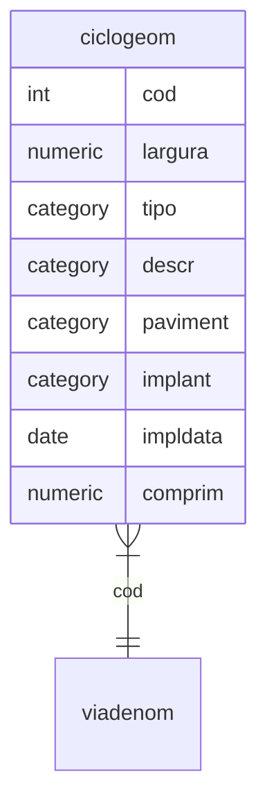

# Malha viária

## viageom: classe de feições, propriedades por seção (polilinha)

Nome     | Campo                                                                        | Descrição
---------|------------------------------------------------------------------------------|--------------------------------------------------------------------------------------------------------------------
cod      | Código(1)                                                                      | Identificador em comum com malha viária
largura  | Largura(metros)                                                              | Restituição ou projetado
tipo     | ciclovia, ciclofaixa ou compartilhada                                        | Ciclovia segragada por obstáculo, ciclofaixa junto ao fluxo de veículos e compartilhada junto ao fluxo de pedestres
descr    | travessia, quadra                                                            | Particularidades
paviment | concreto, asfalto, sem pavimentação, lajota, paralelepípedo, paver, macadami | Pavimentação da ciclovia
implant  | implantada, primeira fase, segunda fase                                      | Via implantada ou projetada segundo o plano de mobilidade
impldata | data                                                                         | Data de implantação da ciclovia
comprim  | comprimento(metros) do trecho                                                | propriedade da geometria

## descrição regras

1. ligação com a tabela denominação do sistema viário.