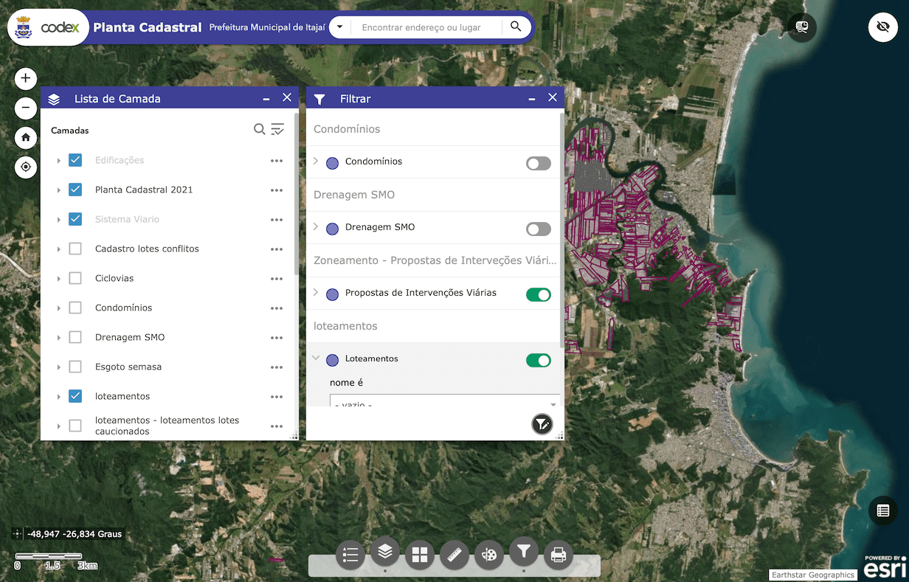
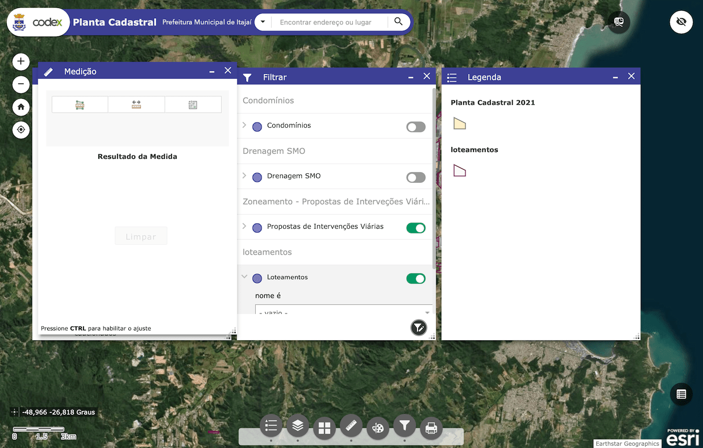
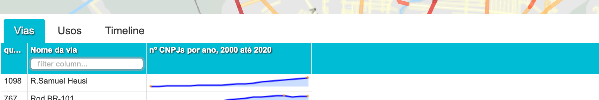
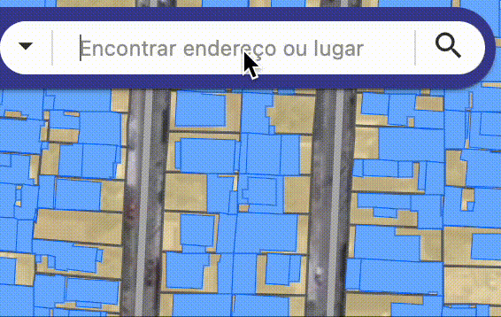
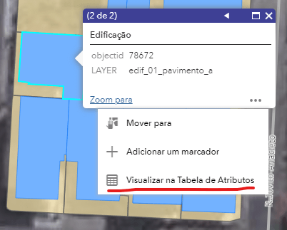
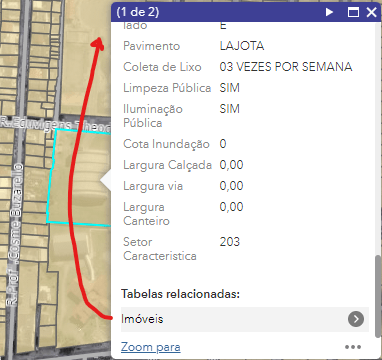

Endereço:

(prévia)[https://arcgis.itajai.sc.gov.br/portal/apps/webappviewer/index.html?id=dba916cd3969414991ea4ab185c2286d]

Estou considerando esta configuração da planta cadastral para o uso interno, em um usuário que possui permissão a visualizar todos os itens disponíveis.

## Visualização e navegação

- A respeito do estilo do basemap, incluir os limites intermunicipais e dando destaque a Itajaí, também inserindo o perímetro urbano (linha) por padrão.
- O número como existe hoje, poderia ser adicionado como rótulo para os lotes, somente a partir de uma escala específica. 
- A codificação do nome das vias possuí um problema, no geoserver/postgresql é utilizado UTF-8.

## Ferramentas

### Botões

- Sugestão para o botão 'Casa' centralizar na área urbana com escala 4x maior.

- A ferramenta coordenada, no canto inferior esquerdo, poderia também exibir as coordenadas em sirgas, é o formato solicitado nos documentos encaminhados à prefeitura.

- Na ferramenta filtro, as interações com os filtros não retornam nada se a camada específica não está ativa, possibilidade da ferramenta filtro e camadas estejam combinadas (melhor pois cada janela aberta sobre o mapa dificulta mais a visualização do mesmo, as janelas camada e filtro ao mesmo tempo sobrepõe quase todo o mapa), se não ao menos quando um filtro for selecionados que a camada a qual ele se relaciona seja ligada automaticamente.

- A respeito da organização das janelas, a possibilidade de dedicar uma barra lateral para que elas sejam organizadas, como na ferramenta 'tabela de atributos' que se organiza na parte inferior da tela. Com duas janelas a visualização do mapa fica comprometida. 2 janelas:  e 3 janelas: .

- A ferramenta tabela de atributos poderia assumir o papel da ferramenta filtros combinada com a ferramenta camadas, reduzindo o número de janelas de ferramentas que precisam permanecer flutuantes durante o uso, existe a possibilidade de adicionar um filtro em algumas colunas? Por exemplo: 

- O minimapa fica de um tamanho exagerado quando se utiliza a opção de ampliação, poderia apenas duplicar o tamanho. 

- A ferramenta Exibição poderia ser renomeada para Relatório, acredito que torna mais clara sua função.

### Pesquisa

- Pesquisa por via ex. 'josé -> enter', retornou 'José, Mineiros, Goiás,BRA'. Remoção dos itens fora de Itajaí como possíveis resultados da pesquisa, ao menos por padrão, como sugestão utilizar o endereço (nome da rua e n˚).

- A respeito das localizações a serem utilizadas na barra de pesquisa, como sugestão poderiam ser estes 4 itens: Sistema viário (autocompletar), endereço (nome rua, n˚), inscrição imobiliária (setor.quadra.face.lote) e por fim o código do cadastro.

- Indicador de progressão está com um problema de alinhamento: 

## Camadas

As propriedades mostradas ainda possuem colunas duplicadas, as tabelas abaixo tem a intenção de compreender quais colunas,ordem e qual a fonte de dados para cada. Também existe a previsão do tipo de dados que mais tarde servirão principalmente os que possuem classes a criação dos filtros. Percebi também que existem alguns problemas na codificação dos dados, as camadas a partir do geoserver ou postgresql estão em UTF-8.
A respeito da visualização quanto ao layout da janela flutuante, a lista de propriedades está bem extensa, poderíamos propor uma versão resumida não necessariamente mostrando todos os itens do espelho, neste caso a opção **Visualizar na Tabela de Atributos**, disponível no menu poderia ter mais detaque
Uma das propriedades mais importantes é a razão social dos proprietários, poderia permanecer em uma aba separada da caixa, contudo para facilitar o acesso colocar o link para abrir logo no topo. 
Camadas: lotes, áreas de conflito, edificações e loteamentos.

### características dos lotes

propriedade             | fonte      | tipo     | visualização
------------------------|------------|----------|-------------------------
inscrição imobiliária   | TMI/planta | texto    | caixa flutuante
inscr. imob. anterior   | TMI        | texto    | caixa flutuante
logradouro              | TMI        | texto    | caixa flutuante
lado                    | TMI        | texto    | caixa flutuante
número                  | TMI        | numérico | caixa flutuante
área terreno            | TMI        | numérico | caixa flutuante
medida frente           | TMI        | numérico | caixa flutuante
medida fundos           | TMI        | numérico | caixa flutuante
área construída         | TMI        | numérico | caixa flutuante
área preservação        | TMI        | numérico | caixa flutuante
patrimônio              | TMI        | classe   | caixa flutuante
imóvel rural            | TMI        | classe   | espelho/tabela atributos
número INCRA            | TMI        | numérico | espelho/tabela atributos
coleta de lixo          | TMI        | classe   | caixa flutuante
limpeza pública         | TMI        | classe   | caixa flutuante
iluminação pública      | TMI        | classe   | caixa flutuante
situação lote           | TMI        | classe   | caixa flutuante
benfeitoria             | TMI        | classe   | caixa flutuante
topografia              | TMI        | classe   | espelho/tabela atributos
piscina                 | TMI        | classe   | espelho/tabela atributos
sauna                   | TMI        | classe   | espelho/tabela atributos
academia                | TMI        | classe   | espelho/tabela atributos
salão de festas         | TMI        | classe   | espelho/tabela atributos
playground              | TMI        | classe   | espelho/tabela atributos
área esportiva          | TMI        | classe   | espelho/tabela atributos
salão de jogos          | TMI        | classe   | espelho/tabela atributos
pavimentação logradouro | planta     | classe   | caixa flutuante
largura via             | planta     | numérico | caixa flutuante
pavimentação passeio    | planta     | classe   | caixa flutuante
largura passeio         | planta     | numérico | caixa flutuante

### características das unidades

propriedade                 | fonte      | tipo     | visualização
----------------------------|------------|----------|-------------------------
inscrição imobiliária       | TMI/planta | texto    | caixa flutuante
código do imóvel            | TMI        | numérico | caixa flutuante
logradouro                  | TMI        | texto    | caixa flutuante
número                      | TMI        | numérico | caixa flutuante
complemento                 | TMI        | texto    | caixa flutuante
bairro                      | TMI        | texto    | caixa flutuante
CEP                         | TMI        | numérico | caixa flutuante
número matrícula            | TMI        | texto    | caixa flutuante
cartório                    | TMI        | texto    | caixa flutuante
ano cancelamento            | TMI        | numérico | caixa flutuante
área tributável unidade     | TMI        | numérico | caixa flutuante
área tributável terreno     | TMI        | numérico | caixa flutuante
acúmulo métrico             | TMI        | numérico | caixa flutuante
área terreno privativo      | TMI        | numérico | caixa flutuante
área construída             | TMI        | numérico | caixa flutuante
fração informada            | TMI        | numérico | caixa flutuante
fração ideal sistema        | TMI        | numérico | caixa flutuante
alíquota                    | TMI        | numérico | caixa flutuante
valor venal territorial     | TMI        | numérico | caixa flutuante
valor venal predial         | TMI        | numérico | caixa flutuante
valor venal total           | TMI        | numérico | caixa flutuante
taxação                     | TMI        | classe   | caixa flutuante
ano construção              | TMI        | numérico | espelho/tabela atributos
data habite-se              | TMI        | data     | caixa flutuante
ct. art. 25 territorial     | TMI        | texto    | espelho/tabela atributos
ct. art. 25 predial         | TMI        | texto    | espelho/tabela atributos
correspondência CEP         | TMI        | numérico | espelho/tabela atributos
correspondência complemento | TMI        | texto    | espelho/tabela atributos
correspondência logradouro  | TMI        | texto    | espelho/tabela atributos
correspondência número      | TMI        | numérico | espelho/tabela atributos
correspondência cidade      | TMI        | texto    | espelho/tabela atributos
correspondência UF          | TMI        | texto    | espelho/tabela atributos
número autônoma             | TMI        | numérico | espelho/tabela atributos
unidade                     | TMI        | numérico | espelho/tabela atributos
tipo de uso                 | TMI        | classe   | caixa flutuante
tipologia                   | TMI        | classe   | caixa flutuante
espécie                     | TMI        | classe   | espelho/tabela atributos
utilização                  | TMI        | classe   | espelho/tabela atributos
situação edificação         | TMI        | classe   | espelho/tabela atributos
conservação                 | TMI        | classe   | espelho/tabela atributos
acabamento                  | TMI        | classe   | espelho/tabela atributos
disposição lote             | TMI        | classe   | espelho/tabela atributos
número pavimentos unidade   | TMI        | numérico | espelho/tabela atributos
número pavimentos total     | TMI        | numérico | espelho/tabela atributos
número hidrômetro           | TMI        | texto    | espelho/tabela atributos
quartos                     | TMI        | numérico | espelho/tabela atributos
banheiros                   | TMI        | numérico | espelho/tabela atributos

### proprietários e responsáveis

propriedade                | fonte | tipo
---------------------------|-------|------
razão social proprietários | TMI   | texto
cnpj/cpf                   | TMI   | texto
telefone                   | TMI   | texto
