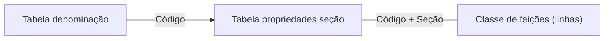
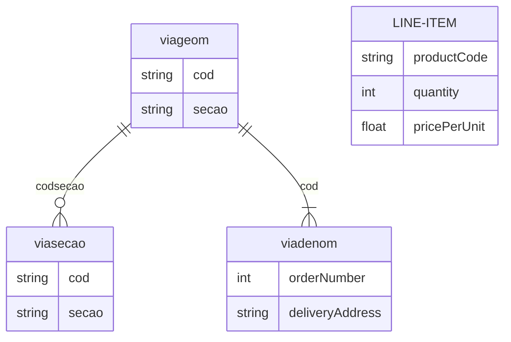

# Malha viária

## Classe de feições

Feições espaciais, linhas.

Ligação com Tabela propriedades seção: Código + Seção

Nome  | Campo   | Descrição
------|---------|------------------------------------
cod   | *Código | Identificador
secao | *Seção  | Composição para identificador único

## Tabela propriedades seção

Detalhe em cada seção.

Ligação com Tabela denominação: Código

Nome     | Campo                  | Descrição
---------|------------------------|----------------------------------------------------------------------
cod      | *Código                | Identificador
secao    | *Seção                 | Composição para identificador único
elevapi  | Elevação ponto inicial | Representação da conectividade tridimencional
elevapf  | Elevação ponto final   | Representação da conectividade tridimencional
sentido  | Sentido tráfego        | Null(duplo), FT(coindide c/digitalização) e TF(inverso digitalização)
comprim  | Comprimento            | Propriedade geométrica
hierarq  | Hierarquia             | Classe (Expressa, Arterial, Coletora ou local)
velocid  | Velocidade             | Limite de velocidade na via
loteacod | Código loteamento      | Código do loteamento de origem
loteanom | Nome loteamento        | Nome de identificação no loteamento de origem
largura  | Largura                | Largura muro a muro da seção
paviment | Pavimentação           | Tipo de pavimentação na faixa de rolamento

## Tabela denominação

Denominação e propriedades únidas em toda a via.

Campo             | Descrição
------------------|----------------------------------------------------
*Código           | Identificador
Logradouro        | Denominação
Tipo              | Categoria (rua, servidão, travessa, avenida ...)
Tipo abreviado    | R., Av., Rod. ...
Prefixo           | Acessório denominação (Vereador, Professor, Doutor)
Prefixo abreviado | Dep., Ver., Dr. ...
Nome abreviado    | R.João T.Pinto, R.Bruno V.da Luz ...
Lei               | Lei/data que dá denominação a via
Código TMI        | Relação com tabela tributária

