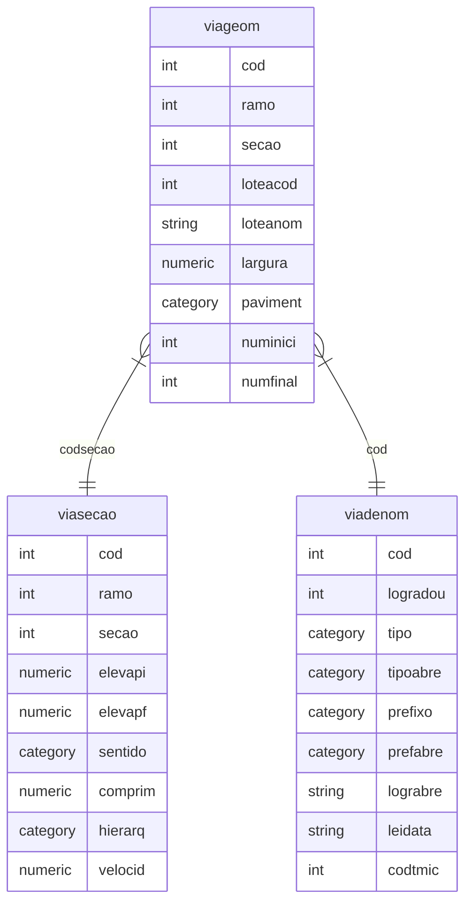

# Malha viária

## viageom: classe de feições

Nome     | Campo             | Descrição
---------|-------------------|----------------------------------------------------------------------------
cod      | *Código           | Identificador
ramo     | *Ramo             | 1 principal para geocodificação, demais detalhamento da malha
secao    | *Seção            | Ordem do trecho atual, crescente no sentido da via
loteacod | Código loteamento | Código do loteamento de origem
loteanom | Nome loteamento   | Nome de identificação no loteamento de origem
largura  | Largura           | Largura muro a muro da seção
paviment | Pavimentação      | Tipo de pavimentação na faixa de rolamento
numinici | Número inicial    | Valor acumulado do comprimento da via até o poto inicial da seção atual (1)
numfinal | Número final      | Número infical + comprimento (2)

## viasecao: tabela propriedades seção

Nome    | Campo                  | Descrição
--------|------------------------|----------------------------------------------------------------------
cod     | *Código                | "
ramo    | *Ramo                  | "
secao   | *Seção                 | "
elevapi | Elevação ponto inicial | Representação da conectividade tridimensional
elevapf | Elevação ponto final   | Representação da conectividade tridimensional
sentido | Sentido tráfego        | Null(duplo), FT(coindide c/digitalização) e TF(inverso digitalização)
comprim | Comprimento            | Propriedade geométrica
hierarq | Hierarquia             | Classe (Expressa, Arterial, Coletora ou local)
velocid | Velocidade             | Limite de velocidade na via

## viadenom: tabela denominação

Nome     | Campo             | Descrição
---------|-------------------|----------------------------------------------------
cod      | *Código           | "
logradou | Logradouro        | Denominação
tipo     | Tipo              | Categoria (rua, servidão, travessa, avenida ...)
tipoabre | Tipo abreviado    | R., Av., Rod. ...
prefixo  | Prefixo           | Acessório denominação (Vereador, Professor, Doutor)
prefabre | Prefixo abreviado | Dep., Ver., Dr. ...
lograbre | Nome abreviado    | R.João T.Pinto, R.Bruno V.da Luz ...
leidata  | Lei               | Lei/data que dá denominação a via
codtmic  | Código TMI        | Relação com tabela tributária

## descrição regras

1. Número inicial(numinici): Relacionar todas as seções do ramo principal menores que a atual, somar seus comprimentos.

2. Número final(numfinal): Relacionar todas as seções do ramo principal incluindo a atual, somar seus comprimentos.